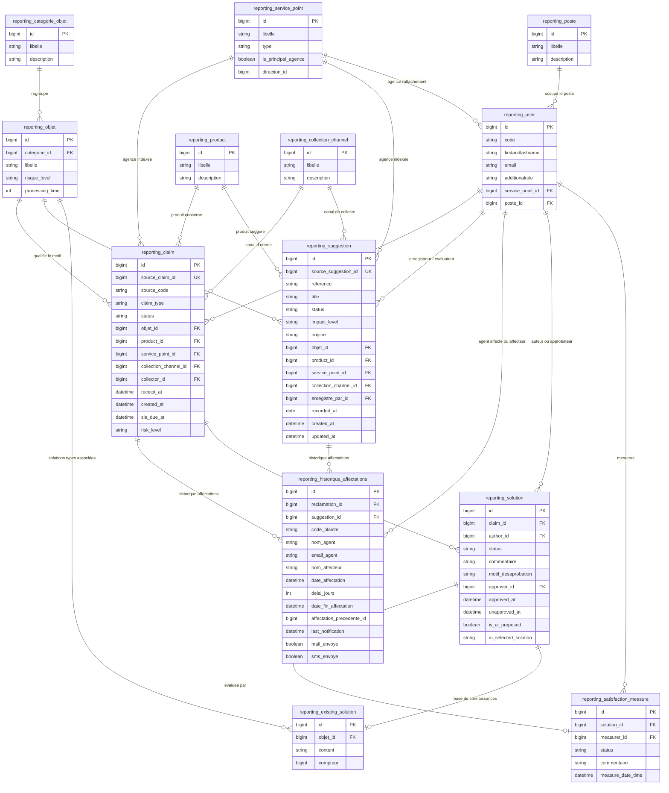
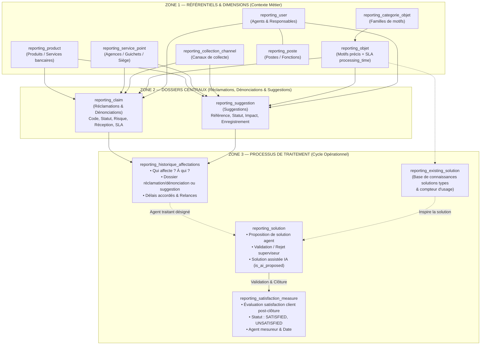

# Inventaire Step 1 : Projection `gpr_ai_reporting`, Dossiers Centraux (Réclamations & Suggestions), Processus de Traitement, Référentiels, Données Sensibles, Règles d'Accès et Dialecte SQL

> **Document officiel de référence — Step 1 (Text-to-SQL Gouverné)**  
> Ce document consigne l'inventaire complet de la projection analytique `gpr_ai_reporting`, couvrant les **dossiers centraux** (réclamations et **suggestions**), le **processus de traitement** et les **référentiels métier**, conformément au point 1 de la section 15 de [`REPORTING_IA_BACKEND_PLAN.md`](./REPORTING_IA_BACKEND_PLAN.md).

---

## 1. Schémas Visuels de la Base Analytique

### 1.1. Modèle Relationnel Global (Diagramme Entité-Association)

---

### 1.2. Flux Métier et Zones Fonctionnelles

---

## 2. Cartographie Détaillée des Tables de la Base Analytique

### 2.1. Table Pivot Centrale : `reporting_claim` (Réclamations & Dénonciations)

Table pivot portant les indicateurs essentiels des dossiers de **réclamations** (`CLAIM`) et de **dénonciations** (`DENUNCIATION`) :

| Colonne | Type SQL | Index / Contrainte | Rôle & Utilité Métier |
| :--- | :--- | :--- | :--- |
| **`id`** | `BIGINT` | `PRIMARY KEY`, Auto-incrément | Identifiant interne reporting. |
| **`source_claim_id`** | `BIGINT` | `UNIQUE CONSTRAINT` | Clé d'origine dans la base opérationnelle (`gps_claim.id` / `denunciations.id`). |
| **`source_code`** | `VARCHAR(255)` | — | Référence métier unique du dossier (ex. `REC-2026-001`, `DEN-2026-001`). |
| **`client_code`** | `VARCHAR(255)` | — | 🔴 **DONNÉE SENSIBLE** (Identifiant client pour `CLAIM` ; `NULL` par construction pour `DENUNCIATION` anonyme). |
| **`claim_type`** | `VARCHAR(40)` | Indexé | Type de dossier : `CLAIM` (Réclamation) ou `DENUNCIATION` (Dénonciation). *(Les suggestions sont quant à elles isolées dans `reporting_suggestion`)*. |
| **`status`** | `VARCHAR(40)` | Indexé | Statut opérationnel (`SAVED`, `AFFECTED`, `TREAT`, `SATISFIED`, etc.). *(Brouillon `TEMP_SAVED` exclu)*. |
| **`objet_id`** | `BIGINT` | Indexé | Clé étrangère vers `reporting_objet`. |
| **`product_id`** | `BIGINT` | Indexé | Clé étrangère vers `reporting_product`. |
| **`service_point_id`**| `BIGINT` | Indexé | Clé étrangère vers `reporting_service_point` (agence indexée). |
| **`collection_channel_id`**| `BIGINT` | Indexé | Clé étrangère vers `reporting_collection_channel`. |
| **`collector_id`** | `BIGINT` | Indexé | Clé étrangère vers `reporting_user` (agent collecteur). |
| **`content`** | `TEXT` | — | 🔴 **DONNÉE SENSIBLE** (Texte brut saisi ou transcrit de la plainte). |
| **`solution`** | `TEXT` | — | 🔴 **DONNÉE SENSIBLE** (Texte de la solution finale retenue). |
| **`ai_urgency`** | `VARCHAR(40)` | — | Gravité détectée par l'IA : `MINEUR`, `MOYEN`, `GRAVE`. |
| **`ai_sentiment`**| `VARCHAR(40)` | — | Sentiment détecté : `neutre`, `negatif`, `tres_negatif`. |
| **`risk_level`** | `VARCHAR(40)` | Indexé | Risque métier issu du motif (`gps_objet.risqueLevel`). |
| **`ai_risk_score`**| `DOUBLE` | — | Score numérique de risque calculé (0 à 100). |
| **`receipt_at`** | `DATETIME` | — | **Date de référence pivot** (réception effective du dossier). |
| **`created_at`** | `DATETIME` | Indexé | Horodatage de création en base. |
| **`source_updated_at`**| `DATETIME` | Indexé | Curseur de synchronisation incrémentale. |
| **`affected_at`** | `DATETIME` | — | Date de première affectation. |
| **`resolved_at`** | `DATETIME` | — | Date de résolution effective. |
| **`sla_due_at`** | `DATETIME` | — | Date d'échéance SLA calculée selon la durée du motif (`receipt_at + processingTime`). |
| **`satisfaction_status`**| `VARCHAR(40)` | — | Statut de satisfaction final (`SATISFIED`, `UNSATISFIED`, `PARTIAL_SATISFIED`). |
| **`synced_at`** | `DATETIME` | — | Horodatage de réplication dans la base de reporting. |

---

### 2.2. Table des Suggestions : `reporting_suggestion` *(Source : `suggestions` / `SuggestionJpaEntity`)*

Table dédiée aux propositions d'amélioration, idées et retours constructifs :

| Colonne | Type SQL | Index / Contrainte | Rôle & Utilité Métier |
| :--- | :--- | :--- | :--- |
| **`id`** | `BIGINT` | `PRIMARY KEY`, Auto-incrément | Identifiant interne reporting. |
| **`source_suggestion_id`** | `BIGINT` | `UNIQUE CONSTRAINT` | Clé d'origine opérationnelle (`suggestions.id`). |
| **`reference`** | `VARCHAR(255)` | — | Référence métier unique (ex. `SUG-2026-001`). |
| **`title`** | `VARCHAR(255)` | — | Titre court ou intitulé de la suggestion. |
| **`description`** | `TEXT` | — | 🔴 **DONNÉE SENSIBLE** (Contenu narratif détaillé de l'idée/proposition). |
| **`client_code`** | `VARCHAR(255)` | — | 🔴 **DONNÉE SENSIBLE** (Identifiant client bancaire si rattaché). |
| **`client_name`** | `VARCHAR(255)` | — | 🔴 **DONNÉE SENSIBLE** (Nom complet du suggérant). |
| **`phone`** | `VARCHAR(50)` | — | 🔴 **DONNÉE SENSIBLE** (Numéro de téléphone). |
| **`email`** | `VARCHAR(255)` | — | 🔴 **DONNÉE SENSIBLE** (Adresse email). |
| **`channel`** | `VARCHAR(50)` | — | Canal de soumission brut. |
| **`status`** | `VARCHAR(40)` | Indexé | Statut opérationnel (`ENREGISTREE`, `EN_COURS_ETUDE`, `ADOPTEE`, `REJETEE`, `CLOTUREE`). |
| **`impact_level`** | `VARCHAR(40)` | Indexé | Niveau d'impact attendu (`FAIBLE`, `MOYEN`, `FORT`, `STRATEGIQUE`). |
| **`origine`** | `VARCHAR(20)` | Indexé | Origine du flux : `INTERNE` (agent) ou `EXTERNE` (portail public client). |
| **`objet_id`** | `BIGINT` | Indexé | Clé étrangère vers `reporting_objet` (thématique / objet ciblé). |
| **`product_id`** | `BIGINT` | Indexé | Clé étrangère vers `reporting_product` (produit/service concerné). |
| **`service_point_id`** | `BIGINT` | Indexé | Clé étrangère vers `reporting_service_point` (agence concernée). |
| **`collection_channel_id`** | `BIGINT` | Indexé | Clé étrangère vers `reporting_collection_channel`. |
| **`enregistre_par_id`** | `BIGINT` | Indexé | Clé étrangère vers `reporting_user` (agent enregistreur). |
| **`evaluator_notes`** | `TEXT` | — | 🔴 **DONNÉE SENSIBLE** (Notes d'analyse et avis du comité/évaluateur). |
| **`motif_rejet_soumission`**| `TEXT` | — | Motif de rejet du contrôle anti-canular (si origine `EXTERNE`). |
| **`recorded_at`** | `DATE` / `DATETIME` | Indexé | **Date de référence pivot** (date d'enregistrement de la suggestion). |
| **`created_at`** | `DATETIME` | Indexé | Horodatage de création en base. |
| **`updated_at`** | `DATETIME` | Indexé | Horodatage de dernière modification. |
| **`synced_at`** | `DATETIME` | — | Horodatage de réplication dans la base de reporting. |

---

### 2.3. Les Tables du Processus de Traitement

#### A. Table `reporting_historique_affectations` *(Source : `gps_historique_affectations` / `affectations`)*
Trace l'ensemble des mouvements, affectations et réaffectations (réclamations ET suggestions) :
* **`id`** (`BIGINT PK`) : Identifiant unique de l'affectation.
* **`reclamation_id`** (`BIGINT FK`) : Référence du dossier réclamation (`reporting_claim.source_claim_id`, nullable si suggestion).
* **`suggestion_id`** (`BIGINT FK`) : Référence de la suggestion (`reporting_suggestion.source_suggestion_id`, nullable si réclamation) — *Convention XOR conforme au schéma V9 du backend*.
* **`code_plainte`** (`VARCHAR`) : Numéro de référence métier du dossier.
* **`type_plainte`** (`VARCHAR`) : `CLAIM`, `DENUNCIACION`, `SUGGESTION`.
* **`nom_agent`** / **`email_agent`** (`VARCHAR`) : Agent traitant désigné.
* **`affecteur_id`** / **`nom_affecteur`** / **`email_affecteur`** (`VARCHAR`) : Responsable ayant procédé à l'affectation.
* **`date_affectation`** (`DATETIME`) : Horodatage d'affectation.
* **`delai_jours`** (`INT`) : Délai imparti accordé à l'agent.
* **`date_fin_affectation`** (`DATETIME`) : Date limite accordée à l'agent.
* **`affectation_precedente_id`** (`BIGINT`) : Clé de l'affectation antérieure *(détection des réaffectations successives)*.
* **`last_notification`** (`DATETIME`) : Date de la dernière relance envoyée à l'agent.
* **`mail_envoye`** / **`sms_envoye`** (`BOOLEAN`) : Statuts d'envoi des notifications.

#### B. Table `reporting_solution` *(Source : `gps_solution`)*
Trace le cycle de proposition et de validation des réponses :
* **`id`** (`BIGINT PK`) : Identifiant de la solution.
* **`claim_id`** (`BIGINT FK`) : Lien vers le dossier.
* **`author_id`** (`BIGINT FK`) : Agent ayant rédigé la proposition.
* **`status`** (`VARCHAR`) : Statut de validation (`PENDING`, `VALIDATED`, `REJECTED`).
* **`commentaire`** (`TEXT`) : Commentaire interne de l'agent.
* **`motif_desaprobation`** (`TEXT`) : Motif de rejet exprimé par le superviseur.
* **`approver_id`** (`BIGINT FK`) : Superviseur ayant validé.
* **`approved_at`** (`DATETIME`) : Date d'approbation.
* **`unapproved_at`** (`DATETIME`) : Date de désapprobation / rejet.
* **`is_ai_proposed`** (`BOOLEAN`) : Indicateur de solution suggérée par l'IA.
* **`ai_selected_solution`** (`TEXT`) : Contenu brut suggéré par le modèle IA.

#### C. Table `reporting_existing_solution` *(Source : `gps_existing_solution`)*
Base de connaissances des solutions types :
* **`id`** (`BIGINT PK`) : Identifiant de la solution type.
* **`objet_id`** (`BIGINT FK`) : Motif associé (`reporting_objet`).
* **`content`** (`TEXT`) : Modèle de solution réutilisable.
* **`compteur`** (`BIGINT`) : Nombre d'utilisations dans les résolutions effectives.

#### D. Table `reporting_satisfaction_measure` *(Source : `gps_satisfaction_measure`)*
Évaluations post-résolution :
* **`id`** (`BIGINT PK`) : Identifiant de l'évaluation.
* **`solution_id`** (`BIGINT FK`) : Solution évaluée.
* **`measurer_id`** (`BIGINT FK`) : Agent ayant réalisé la mesure de satisfaction.
* **`status`** (`VARCHAR`) : Statut client (`SATISFIED`, `UNSATISFIED`, `PARTIAL_SATISFIED`).
* **`commentaire`** (`TEXT`) : Feedback textuel client.
* **`measure_date_time`** (`DATETIME`) : Horodatage de l'enquête.

---

### 2.4. Les Tables de Référentiels & Dimensions

#### A. Table `reporting_product` *(Source : `gps_product`)*
Catalogue des produits et services financiers :
* **`id`** (`BIGINT PK`), **`libelle`** (`VARCHAR UNIQUE`), **`description`** (`TEXT`), **`is_deleted`** (`BOOLEAN`).

#### B. Table `reporting_service_point` *(Source : `gps_service_point`)*
Réseau d'agences et points de service :
* **`id`** (`BIGINT PK`), **`libelle`** (`VARCHAR UNIQUE`), **`description`** (`TEXT`), **`type`** (`VARCHAR` : `AGENCE`, `GUICHET`, `SIEGE`), **`is_principal_agence`** (`BOOLEAN`), **`direction_id`** (`BIGINT`).

#### C. Table `reporting_categorie_objet` *(Source : `gps_categorie_objet`)*
Grandes familles de réclamations :
* **`id`** (`BIGINT PK`), **`libelle`** (`VARCHAR UNIQUE`), **`description`** (`TEXT`).

#### D. Table `reporting_objet` *(Source : `gps_objet`)*
Motifs détaillés et contraintes SLA :
* **`id`** (`BIGINT PK`), **`categorie_id`** (`BIGINT FK`), **`libelle`** (`VARCHAR UNIQUE`), **`risque_level`** (`VARCHAR` : `MINEUR`, `MOYEN`, `GRAVE`), **`processing_time`** (`INT` : délai SLA contractuel en jours).

#### E. Table `reporting_collection_channel` *(Source : `gps_collection_channel`)*
Canaux de collecte :
* **`id`** (`BIGINT PK`), **`libelle`** (`VARCHAR UNIQUE` : `WEB`, `AGENCE`, `WHATSAPP`, `COURRIER`, `TELEPHONE`), **`description`** (`TEXT`).

#### F. Table `reporting_user` *(Source : `gps_user`)* & `reporting_poste` *(Source : `gps_poste`)*
Acteurs de l'organisation :
* **`reporting_user`** : `id` (`BIGINT PK`), `code` (`VARCHAR UNIQUE`), `firstandlastname` (`VARCHAR`), `email` (`VARCHAR UNIQUE`), `additionalrole` (`VARCHAR`), `service_point_id` (`BIGINT FK`), `poste_id` (`BIGINT FK`).
* **`reporting_poste`** : `id` (`BIGINT PK`), `libelle` (`VARCHAR`), `description` (`TEXT`).

---

### 2.5. Tables d'Administration & Suivi

* **`reporting_sync_state`** : Suivi des synchronisations incrémentales (`sync_name`, `last_successful_sync_at`, compteurs).
* **`reporting_alert`** : Persistance des alertes et anomalies détectées (`source_key`, `alert_type`, `severity`, `status`, `detected_at`).

---

## 3. Données Sensibles et Règles d'Exclusion Formelles

| Champ / Donnée | Emplacement | Nature du Risque | Règle de Protection pour l'IA |
| :--- | :--- | :--- | :--- |
| **`client_code`** | `reporting_claim`, `reporting_suggestion` | Identifiant client nominatif. | **Exclusion absolue** du Schema Catalog et des filtres LLM. |
| **`client_name`, `phone`, `email`** | `reporting_suggestion` | Coordonnées et identité du suggérant. | **Exclusion absolue** du Schema Catalog et des requêtes générées. |
| **`content`** | `reporting_claim` | Texte brut de la plainte (potentiels coordonnées, RIB, comptes). | **Exclusion absolue** : jamais transmis dans le prompt pour générer du SQL. |
| **`description`** | `reporting_suggestion` | Texte libre de la proposition (idées, retours narratifs). | **Exclusion absolue** : jamais transmis dans le prompt pour générer du SQL. |
| **`solution`** | `reporting_claim`, `reporting_solution` | Texte de résolution et propositions commerciales. | **Exclusion absolue** du contexte d'agrégation SQL. |
| **`evaluator_notes`** | `reporting_suggestion` | Notes et délibérations internes de l'évaluateur. | **Exclusion absolue** : confidentiel interne, exclu des filtres et prompts. |
| **Mots de passe / Téléphones agents** | `reporting_user` | Données privées des agents. | **Non répliqués** : la table `reporting_user` n'intègre aucun mot de passe ni numéro personnel. |

---

## 4. Règles d'Accès et Dialecte SQL Réel

1. **Règles d'Accès** :
   * **Mono-institution** : Pas de filtre multi-tenant requis au niveau SQL.
   * **Lecture Seule Stricte** : Compte MySQL restreint au privilège `SELECT` sur `gpr_ai_reporting.*` exclusivement.
   * **Isolation Totale** : Aucun accès à la base de production `gpr_sicma_online` ni aux tables système (`information_schema`, `mysql`).
   * **Garde-fous** : `LIMIT 500` systématique, timeout de 3 secondes par requête.
2. **Dialecte SQL Réel** :
   * **MySQL 8.0 (`utf8mb4`)** : Fuseau horaire `Africa/Porto-Novo` (UTC+1), comparaison semi-ouverte `[début, début_lendemain[`, paramètres liés obligatoires (`:param`).
   * **SQLite (en mémoire)** : Utilisé pour les tests unitaires ANSI SQL automatisés.

---

## 5. Bilan de Validation

Ce document consigne l'architecture relationnelle complète et définitive de la base analytique `gpr_ai_reporting`. Il sert de contrat de base pour le **Schema Catalog** et le **Business Catalog** du moteur Text-to-SQL.
