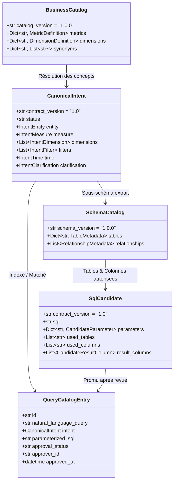

# Plan Détaillé Step 2 : Contrats Versionnés d'Intention, Catalogues, SQL Candidat et Approbation

> **Document officiel de référence — Step 2 (Text-to-SQL Gouverné)**  
> **Conformité** : Point 2 de la section 15 de [`REPORTING_IA_BACKEND_PLAN.md`](./REPORTING_IA_BACKEND_PLAN.md) et architecture cible de [`PLAN_IMPLANTATION_REPORTING_TEXT_TO_SQL.md`](./PLAN_IMPLANTATION_REPORTING_TEXT_TO_SQL.md).  
> **Prérequis validé** : Inventaire complet des 12 tables, données sensibles et dialectes consigné dans [`INVENTAIRE_STEP_1.md`](./INVENTAIRE_STEP_1.md).

---

## 1. Objectif du Step 2

Le **Step 2** a pour but d'établir l'ensemble des **contrats d'interfaces formels (modèles Pydantic stricts et versionnés)** régissant les échanges entre :
1. L'analyseur d'intention du modèle Nemotron,
2. Le moteur de recherche du *Query Catalog*,
3. Le *Schema Retriever* s'appuyant sur le *Schema Catalog* et le *Business Catalog*,
4. Le générateur de SQL candidat paramétré (`:param`),
5. Le *Validateur AST SQL*,
6. Le mécanisme de gouvernance et de revue humaine (*Query Catalog Approval*).

L'ensemble de ces contrats sera centralisé et formalisé dans :  
📁 `app/reporting/text_to_sql_contracts.py`  
accouplé à sa suite de tests unitaires :  
📁 `tests/test_text_to_sql_contracts.py`

---

## 2. Vue d'Ensemble des 5 Briques de Contrats

---

## 3. Brique 1 : Contrats d'Intention Canonique (`CanonicalIntent`)

L'intention canonique est la structure intermédiaire pure produite par Nemotron à partir de la question de l'utilisateur. Le LLM ne produit **aucun code SQL** à cette étape.

### 3.1. Architecture Terminologique & Entité Unique (`IntentEntity`)

Dans la conception du SI GPR, il n'existe pas d'entités métier morcelées : **`plainte` est l'entité centrale unificatrice**.

#### Règle Terminologique Métier :
1. **« Plainte »** $\rightarrow$ Fait référence à **l'ensemble des 3 types de dossiers** : Réclamations (`CLAIM`), Dénonciations (`DENUNCIATION`) et Suggestions (`SUGGESTION`).
2. **« Réclamation »** $\rightarrow$ Fait référence spécifiquement au sous-type **`CLAIM`**.
3. **« Dénonciation »** $\rightarrow$ Fait référence spécifiquement au sous-type **`DENUNCIATION`**.
4. **« Suggestion »** $\rightarrow$ Fait référence spécifiquement au sous-type **`SUGGESTION`**.

#### Matrice de Résolution : Terminologie $\leftrightarrow$ Intention $\leftrightarrow$ Tables SQL Réelles

| Terme formulé par l'utilisateur | Modèle Pydantic `IntentEntity` | Table(s) SQL cible(s) dans `gpr_ai_reporting` | Clause / Condition SQL |
| :--- | :--- | :--- | :--- |
| **« Plaintes »** (ou « dossiers ») | `concept_id="plainte"` `include_all_types=True` `types=["CLAIM", "DENUNCIATION", "SUGGESTION"]` | `reporting_claim` + `reporting_suggestion` | Agrégation globale unifiée des deux tables physiques |
| **« Réclamations »** | `concept_id="plainte"` `include_all_types=False` `types=["CLAIM"]` | `reporting_claim` | `WHERE claim_type = 'CLAIM'` |
| **« Dénonciations »** | `concept_id="plainte"` `include_all_types=False` `types=["DENUNCIATION"]` | `reporting_claim` | `WHERE claim_type = 'DENUNCIATION'` *(anonyme par construction)* |
| **« Suggestions »** | `concept_id="plainte"` `include_all_types=False` `types=["SUGGESTION"]` | `reporting_suggestion` | Requête ciblée sur la table dédiée `reporting_suggestion` |

#### Autres Concepts Cibles Spécialisés :
* **`treatment`** : Processus opérationnel transversal (`reporting_historique_affectations`, `reporting_solution`, `reporting_satisfaction_measure`).
* **`metrics`** : Ratios globaux certifiés (SLA, satisfaction, performance par agence).

### 3.2. Mesures Autorisées (`IntentMeasure`)
Formules canoniques pouvant être demandées :
* **`plainte_count`** : Nombre de plaintes (global tous types, ou filtré sur réclamations, dénonciations ou suggestions selon l'intention).
* **`avg_processing_time`** : Délai moyen de traitement effectif en jours (sur `reporting_claim` pour réclamations/dénonciations).
* **`sla_adherence_rate`** : Taux de dossiers résolus dans le délai contractuel SLA (sur `reporting_claim`).
* **`satisfaction_rate`** : Taux d'usagers satisfaits post-résolution (`reporting_satisfaction_measure` ou `reporting_claim`).
* **`reaffectation_count`** : Nombre de réaffectations successives (`reporting_historique_affectations`).
* **`adoption_rate`** : Taux de suggestions adoptées (`reporting_suggestion`).

### 3.3. Dimensions d'Analyse (`IntentDimension`)
Axes d'agrégation et de regroupement (`GROUP BY`) :
* `agency` : Agence bancaire / point de service (`reporting_service_point.libelle`).
* `channel` : Canal d'entrée (`reporting_collection_channel.libelle`).
* `product` : Produit ou service concerné (`reporting_product.libelle`).
* `category` : Famille de réclamation (`reporting_categorie_objet.libelle`).
* `object` : Motif précis de réclamation (`reporting_objet.libelle`).
* `status` : Statut opérationnel (`SAVED`, `TREAT`, `ADOPTEE`, etc.).
* `risk_level` : Niveau de risque (`MINEUR`, `MOYEN`, `GRAVE`).
* `impact_level` : Niveau d'impact suggestion (`FAIBLE`, `MOYEN`, `FORT`, `STRATEGIQUE`).
* `agent` : Agent affecté ou responsable (`reporting_user.firstandlastname`).
* `period` : Grain temporel (`year`, `month`, `day`).

### 3.4. Filtres Typés (`IntentFilter`)
Conditions de restriction (`WHERE`) :
* `concept_id` : L'une des dimensions ou attributs ci-dessus.
* `operator` : `equals`, `in`, `greater_than`, `less_than`, `between`.
* `value` / `values` : Valeurs typées strictes (chaînes ou nombres, pas d'objets bruts).

### 3.5. Fenêtre Temporelle (`IntentTime`)
Normalisation stricte de la période :
* `field_concept` : `receipt_date` (dossiers), `recorded_date` (suggestions), `resolved_date` (résolutions).
* `start_date` : Date de début (inclusive `YYYY-MM-DD`).
* `end_date` : Date de fin (exclusive `[start_date, end_date[` pour couvrir jusqu'à `23:59:59` de la veille du jour suivant).
* `timezone` : Stricte conformité avec `Africa/Porto-Novo` (UTC+1).

### 3.6. Statuts et Clarifications
* **`ready`** : Intention complète, non ambiguë, prête pour le Query Catalog ou la génération SQL.
* **`needs_clarification`** : Demande d'informations complémentaires à l'utilisateur (ex: période non précisée, agence ambiguë). Contient le message et la question à afficher.
* **`unsupported`** : Hors périmètre analytique (ex: question sur les soldes de comptes bancaires ou virement). Contient le motif du refus.

---

## 4. Brique 2 : Contrats du Schema Catalog (`SchemaCatalog`)

Le **Schema Catalog** est le contrat de description formelle de la base `gpr_ai_reporting`. Il expose la structure statique autorisée, sans introspection dynamique à l'exécution.

### 4.1. Modèles de Données du Schema Catalog
* **`ColumnMetadata`** :
  * `name` : Nom physique de la colonne.
  * `data_type` : `BIGINT`, `VARCHAR`, `DATETIME`, `DATE`, `INT`, `DOUBLE`, `BOOLEAN`, `TEXT`.
  * `is_primary_key` : Booléen.
  * `is_foreign_key` : Booléen.
  * `references_table` : Nom de la table cible si clé étrangère.
  * `references_column` : Colonne cible si clé étrangère.
  * `is_nullable` : Booléen.
  * `is_indexed` : Booléen.
  * `is_sensitive` : Booléen (si `True`, **interdit formellement** dans `SELECT`, `WHERE`, `GROUP BY`).
  * `description` : Explication fonctionnelle.
* **`TableMetadata`** :
  * `name` : Nom de la table (ex: `reporting_claim`, `reporting_suggestion`).
  * `table_type` : `fact` (table pivot), `dimension` (référentiel), `workflow` (processus), `admin`.
  * `primary_key` : Colonne PK.
  * `description` : Rôle métier de la table.
  * `columns` : Dictionnaire des `ColumnMetadata`.
* **`RelationshipMetadata`** :
  * `name` : Identifiant de la relation (ex: `claim_to_service_point`).
  * `source_table` : Table source.
  * `source_column` : Clé de liaison.
  * `target_table` : Table cible.
  * `target_column` : Clé de liaison.
  * `join_type` : `INNER JOIN` ou `LEFT JOIN`.
  * `description` : Sémantique de la liaison.
* **`SchemaCatalog`** :
  * `schema_version` : `1.0.0`.
  * `database_name` : `gpr_ai_reporting`.
  * `tables` : Dict des `TableMetadata` (les 12 tables inventoriées).
  * `relationships` : Liste des `RelationshipMetadata` autorisées pour les jointures AST.

---

## 5. Brique 3 : Contrats du Business Catalog (`BusinessCatalog`)

Le **Business Catalog** fait le pont entre le langage naturel / métier des banquiers et le schéma technique de la base.

### 5.1. Modèles de Données du Business Catalog
* **`MetricDefinition`** :
  * `metric_id` : Identifiant (ex: `claim_count`, `satisfaction_rate`).
  * `label` : Libellé clair ("Nombre de réclamations", "Taux de satisfaction").
  * `description` : Règle de calcul officielle (normes BCEAO / GPR).
  * `required_tables` : Liste des tables minimales requises.
  * `aggregation_sql_template` : Expression SQL modèle (ex: `COUNT(reporting_claim.id)`).
* **`DimensionDefinition`** :
  * `dimension_id` : Identifiant (ex: `agency`, `product`).
  * `label` : Libellé humain.
  * `source_table` : Table portant la valeur lisible (ex: `reporting_service_point`).
  * `source_column` : Colonne du libellé (ex: `libelle`).
  * `join_path` : Chemin de jointure depuis la table pivot.
* **`SynonymCatalog`** :
  * Mapping exhaustif des synonymes d'usage vers les concepts et filtres canoniques :
    * **Terme générique global** : *"plainte"*, *"plaintes"*, *"dossier"*, *"dossiers"* $\rightarrow$ **Tous les types** : Réclamations (`CLAIM`), Dénonciations (`DENUNCIATION`) et Suggestions (`SUGGESTION`) (`include_all_types = True`).
    * **Réclamations spécifiques** : *"réclamation"*, *"réclamations"*, *"doléance"*, *"doléances"*, *"mécontentement"* $\rightarrow$ type `CLAIM`.
    * **Dénonciations spécifiques** : *"dénonciation"*, *"dénonciations"*, *"fraude"*, *"fraudes"*, *"soupçon"*, *"signalement"* $\rightarrow$ type `DENUNCIATION`.
    * **Suggestions spécifiques** : *"suggestion"*, *"suggestions"*, *"idée"*, *"idées"*, *"proposition d'amélioration"* $\rightarrow$ type `SUGGESTION`.
    * **Agences & Réseau** : *"agences"*, *"guichets"*, *"points de vente"*, *"points de service"* $\rightarrow$ dimension `agency`.

---

## 6. Brique 4 : Contrats du SQL Candidat & Validation AST

Ces contrats cadrent la génération du SQL par Nemotron et sa vérification par le validateur syntaxique.

### 6.1. Contrat `SqlCandidate`
* **`contract_version`** : `"1.0"`.
* **`sql`** : Requête SQL candidate rédigée obligatoirement avec des **paramètres liés** (`:param_name`).
* **`parameters`** : Dictionnaire typé des paramètres déclarés dans la requête (`type`, `value`, `source`).
* **`used_tables`** : Liste des tables invoquées dans la requête.
* **`used_columns`** : Liste des colonnes accédées.
* **`result_columns`** : Liste des colonnes renvoyées par le `SELECT` avec leur typage (`dimension` ou `measure`).
* **`assumptions`** : Hypothèses ou commentaires de génération du LLM.

### 6.2. Contrat `SqlValidationResult`
Produit par le Validateur AST SQL :
* **`is_valid`** : `True` si et seulement si toutes les règles de sécurité sont satisfaites.
* **`ast_digest`** : Résumé de l'arbre syntaxique validé.
* **`allowed_tables_checked`** : Liste des tables vérifiées contre la whitelist.
* **`allowed_columns_checked`** : Liste des colonnes vérifiées contre la whitelist.
* **`join_integrity_checked`** : Vérification que chaque `JOIN` utilise une relation autorisée.
* **`violations`** : Liste des motifs de rejet le cas échéant :
  * Mutation détectée (`INSERT`, `UPDATE`, `DELETE`, etc.),
  * Table hors périmètre (ex: `gps_user`, `information_schema`),
  * Colonne sensible accédée (`client_code`, `content`, `solution`, etc.),
  * Fonction système interdite (`SLEEP`, `BENCHMARK`, etc.),
  * Absence de clause `LIMIT` ou `LIMIT > 500`.

---

## 7. Brique 5 : Contrats d'Approbation & Query Catalog

Ces contrats régissent la gouvernance, la mémorisation et la promotion des requêtes SQL certifiées.

### 7.1. Modèles de Données du Query Catalog
* **`ApprovalStatus`** (Enum) :
  * `PENDING` : Requête candidate générée par l'IA ayant réussi l'exécution, soumise à revue humaine.
  * `APPROVED` : Requête certifiée par un administrateur / expert métier. Exécutable directement sans LLM.
  * `REJECTED` : Requête refusée lors de la revue.
  * `DEPRECATED` : Requête désactivée suite à une évolution de schéma ou de règle métier.
* **`QueryCatalogEntry`** :
  * `id` : Identifiant unique de la requête dans le catalogue (UUID ou hash canonique).
  * `query_catalog_version` : Version de la structure.
  * `intent_signature` : Empreinte de l'intention canonique (permettant le matching exact).
  * `natural_language_examples` : Liste d'exemples de questions équivalentes.
  * `parameterized_sql` : Requête SQL certifiée avec paramètres liés `:param`.
  * `parameters_schema` : Spécification des paramètres attendus.
  * `expected_result_schema` : Schéma de données de la réponse Chart.js (`labels`, `datasets`).
  * `status` : `ApprovalStatus`.
  * `created_by` : Origine (`SYSTEM_SEEDED` ou `AI_GENERATED`).
  * `approved_by` : Identifiant de l'administrateur ayant validé.
  * `approved_at` : Horodatage d'approbation.
  * `schema_version` : Version du schéma lors de l'approbation (`1.0.0`).
  * `execution_count` : Nombre d'utilisations en production.
  * `avg_execution_time_ms` : Temps de réponse moyen mesuré.
  * `last_executed_at` : Horodatage de dernière exécution.

---

## 8. Plan d'Implémentation Technique dans le Code

Pour réaliser ce Step 2 sans aucune régression :

1. **Fichier Source** :
   * Refondre et étendre [`app/reporting/text_to_sql_contracts.py`](file:///c:/Users/HP/Desktop/Projets/GprWeb/gpr_web/gpr_ai/gpr_ai_service/app/reporting/text_to_sql_contracts.py) en implémentant les classes Pydantic stricts des 5 briques.
   * Utiliser la syntaxe Pydantic v2 compatible (`Field`, `model_validator`, `field_validator`, `ConfigDict(extra="forbid")`) tout en conservant les alias pour compatibilité ascendante.

2. **Fichier de Tests Unitaires** :
   * Créer [`tests/test_text_to_sql_contracts.py`](file:///c:/Users/HP/Desktop/Projets/GprWeb/gpr_web/gpr_ai/gpr_ai_service/tests/test_text_to_sql_contracts.py) couvrant :
     * Validation d'intention pour `CLAIM`, `DENUNCIATION`, `SUGGESTION`, `TREATMENT`.
     * Rejet des intentions incomplètes sans champ `clarification`.
     * Rejet des colonnes sensibles dans les contrats de colonnes candidates.
     * Validation de la structure d'entrée du `SchemaCatalog` et du `BusinessCatalog`.
     * Validation des cycles de vie du `QueryCatalogEntry` (`PENDING` $\rightarrow$ `APPROVED`).

3. **Critères d'Acceptation du Step 2** :
   * [x] Tous les modèles Pydantic instancient et valident sans erreur.
   * [x] Aucune colonne sensible ne peut être injectée sans déclencher une `ValidationError`.
   * [x] Les tests unitaires passent à 100% avec `pytest`.
   * [x] Le code est prêt pour servir de socle au **Step 3** (remplissage effectif du Schema Catalog et Business Catalog).
