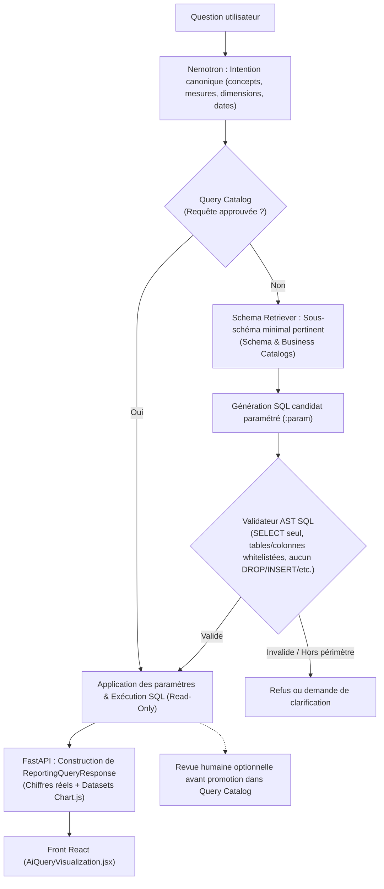

# Architecture Cible et Plan d'Implantation — Reporting IA (Text-to-SQL Gouverné)

> **Document de référence officiel**  
> Ce document formalise l'**architecture cible validée** et son plan d'implantation par étapes, en conformité intégrale avec le schéma directeur validé (`mermaid-diagram.svg`) et [`REPORTING_IA_BACKEND_PLAN.md`](./REPORTING_IA_BACKEND_PLAN.md).

---

## 1. L'Architecture Cible Validée

Voici le schéma officiel et complet du flux de traitement d'une question dans le Reporting IA :

---

## 2. Explication Détaillée des Composants de l'Architecture Cible

### 2.1. Entrée & Interprétation
1. **Question utilisateur** :
   * Posée depuis le chatbot du Front React ([`AiQueryVisualization.jsx`](../../gpr_client_sicma_new_version/src/pages/Rapports/AiQueryVisualization.jsx)).
2. **Nemotron : Intention canonique** :
   * Le modèle LLM n'écrit pas de SQL à cette étape.
   * Il extrait la structure formelle de la demande : entité (`case`), mesure (`case_count`), dimensions demandées (`agency`, `channel`, etc.), filtres et période temporelle (convertie en intervalle semi-ouvert `[début, fin[` selon le fuseau horaire `Africa/Porto-Novo`).
   * Si la question est incomplète ou ambiguë (ex: "depuis lundi"), le statut est marqué comme demandant clarification.

### 2.2. Le double circuit : Requête Approuvée vs Génération Contrôlée
3. **Query Catalog (Requête approuvée ?)** :
   * **Branche OUI (Circuit Rapide & Certifié)** :
     * Si l'intention canonique correspond à une requête déjà validée et enregistrée dans le catalogue, **aucun LLM n'est sollicité pour générer du SQL**.
     * Le backend injecte simplement les paramètres dynamiques (dates, valeurs de filtres) dans la requête pré-approuvée et passe immédiatement à l'exécution.
   * **Branche NON (Circuit Génératif Supervisé)** :
     * La question est nouvelle ou inédite. On enclenche alors le sous-système de génération contrôlée.

4. **Schema Retriever (Schema & Business Catalogs)** :
   * Le LLM ne reçoit **jamais** l'intégralité de la base de données ni de données sensibles/personnelles.
   * Le *Schema Retriever* extrait du *Schema Catalog* et du *Business Catalog* uniquement le **sous-schéma minimal pertinent** pour répondre à l'intention (tables et colonnes strictement nécessaires).

5. **Génération SQL candidat paramétré (`:param`)** :
   * Le LLM produit une requête SQL candidate contenant des **paramètres liés** (ex: `:start_date`, `:agency_param`), sans aucune concaténation directe de valeurs textuelles.

6. **Validateur AST SQL (Le Bouclier de Sécurité)** :
   * Analyse structurelle de l'arbre syntaxique abstrait (AST) :
     * Vérification de l'instruction : uniquement `SELECT` (ou CTE read-only).
     * Whitelist stricte des tables : uniquement la table autorisée de la base miroir (`reporting_claim`).
     * Whitelist stricte des colonnes autorisées.
     * Rejet absolu de tout mot-clé de mutation (`INSERT`, `UPDATE`, `DELETE`, `DROP`, `ALTER`, etc.) ou de fonction système suspecte (`SLEEP`, `BENCHMARK`, etc.).
   * **Si Invalide / Hors périmètre** : Rejet immédiat ou demande de clarification. Aucune requête n'est envoyée à la base.
   * **Si Valide** : Passage à l'exécution.

### 2.3. Exécution & Restitution
7. **Application des paramètres & Exécution SQL (Read-Only)** :
   * Point de convergence des deux branches (requête approuvée OU requête candidate validée par l'AST).
   * Exécution sous compte restreint en lecture seule sur la base miroir `gpr_ai_reporting` avec timeout strict et quota `LIMIT 500`.

8. **Restitution & Gouvernance** :
   * **Vers l'utilisateur** : FastAPI lit les lignes SQL retournées par la base et construit la réponse structurée `ReportingQueryResponse` (chiffres réels + `labels`/`datasets` pour Chart.js), puis la transmet au Front React.
   * **Vers la gouvernance (boucle d'apprentissage continu)** : Une requête candidate qui a été exécutée avec succès peut faire l'objet d'une **revue humaine optionnelle** par les administrateurs pour être promue dans le *Query Catalog* et servir pour les futures questions similaires.

---

## 3. Plan d'Implantation Structuré par Briques

Pour respecter rigoureusement cette architecture sans court-circuit, l'implantation se découpe comme suit :

### Brique 1 : Contrats & Validation AST (Socle de Sécurité)
1. Consolidation des contrats Pydantic d'intention et de candidat SQL ([`text_to_sql_contracts.py`](../app/reporting/text_to_sql_contracts.py)).
2. Implémentation du **Validateur AST SQL** ([`sql_validator.py`](../app/reporting/sql_validator.py)) :
   * Contrôle de l'AST (`SELECT` pur, table `reporting_claim` uniquement, colonnes autorisées).
   * Suite de tests de sécurité et d'injection ([`test_sql_validator.py`](../tests/test_sql_validator.py)).

### Brique 2 : Les Catalogues (Schema, Business & Query)
1. **Schema Catalog & Business Catalog** : description formelle du sous-schéma `reporting_claim` et des concepts métier (mesures, dimensions, synonymes).
2. **Query Catalog initial** : registre des requêtes certifiées pour les questions fréquentes (ex: volume global, répartition par agence, répartition par canal).

### Brique 3 : Moteur de Résolution & Dispatcher
1. Résolution de l'intention canonique via Nemotron.
2. Vérification de correspondance dans le Query Catalog :
   * Si match -> binding des paramètres et exécution.
   * Si absent -> Schema Retriever -> Génération candidate -> Validateur AST.
3. Exécution sécurisée en lecture seule sur `gpr_ai_reporting`.
4. Construction de la réponse pour le Front React ([`ReportingQueryResponse`](../app/reporting/schemas.py)).
5. Traçabilité pour la revue humaine (journalisation du SQL candidat pour promotion ultérieure).

### Brique 4 : Intégration sur `POST /reporting/query` & Validation React
1. Branchement du dispatcher dans `service.py` et `router.py`.
2. Validation de l'expérience utilisateur dans le chatbot React ([`AiQueryVisualization.jsx`](../../gpr_client_sicma_new_version/src/pages/Rapports/AiQueryVisualization.jsx)).
3. Tests de non-régression et audit final.
