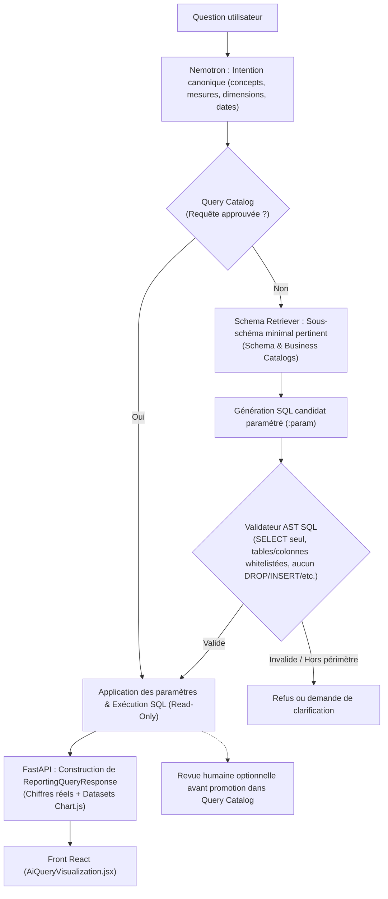
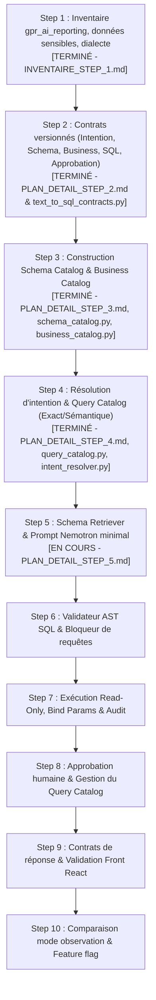

# Architecture Cible et Plan d'Implantation — Reporting IA (Text-to-SQL Gouverné)

> **Document de référence officiel**  
> Ce document formalise l'**architecture cible validée** et son plan d'implantation par étapes, en conformité intégrale avec le schéma directeur validé (`mermaid-diagram.svg`) et [`REPORTING_IA_BACKEND_PLAN.md`](./REPORTING_IA_BACKEND_PLAN.md).

---

## 1. L'Architecture Cible Validée

Voici le schéma officiel et complet du flux de traitement d'une question dans le Reporting IA :

---

## 2. Explication Détaillée des Composants de l'Architecture Cible

### 2.1. Entrée & Interprétation
1. **Question utilisateur** :
   * Posée depuis le chatbot du Front React ([`AiQueryVisualization.jsx`](../../gpr_client_sicma_new_version/src/pages/Rapports/AiQueryVisualization.jsx)).
2. **Nemotron : Intention canonique** :
   * Le modèle LLM n'écrit pas de SQL à cette étape.
   * Il extrait la structure formelle de la demande : entité (`case`), mesure (`case_count`), dimensions demandées (`agency`, `channel`, etc.), filtres et période temporelle (convertie en intervalle semi-ouvert `[début, fin[` selon le fuseau horaire `Africa/Porto-Novo`).
   * Si la question est incomplète ou ambiguë (ex: "depuis lundi"), le statut est marqué comme demandant clarification.

### 2.2. Le double circuit : Requête Approuvée vs Génération Contrôlée
3. **Query Catalog (Requête approuvée ?)** :
   * **Branche OUI (Circuit Rapide & Certifié)** :
     * Si l'intention canonique correspond à une requête déjà validée et enregistrée dans le catalogue, **aucun LLM n'est sollicité pour générer du SQL**.
     * Le backend injecte simplement les paramètres dynamiques (dates, valeurs de filtres) dans la requête pré-approuvée et passe immédiatement à l'exécution.
   * **Branche NON (Circuit Génératif Supervisé)** :
     * La question est nouvelle ou inédite. On enclenche alors le sous-système de génération contrôlée.

4. **Schema Retriever (Schema & Business Catalogs)** :
   * Le LLM ne reçoit **jamais** l'intégralité de la base de données ni de données sensibles/personnelles.
   * Le *Schema Retriever* extrait du *Schema Catalog* et du *Business Catalog* uniquement le **sous-schéma minimal pertinent** pour répondre à l'intention (tables et colonnes strictement nécessaires).

5. **Génération SQL candidat paramétré (`:param`)** :
   * Le LLM produit une requête SQL candidate contenant des **paramètres liés** (ex: `:start_date`, `:agency_param`), sans aucune concaténation directe de valeurs textuelles.

6. **Validateur AST SQL (Le Bouclier de Sécurité)** :
   * Analyse structurelle de l'arbre syntaxique abstrait (AST) :
     * Vérification de l'instruction : uniquement `SELECT` (ou CTE read-only).
     * Whitelist stricte des tables : uniquement les tables analytiques autorisées de `gpr_ai_reporting` inventoriées au Step 1 (`reporting_claim`, `reporting_suggestion`, `reporting_historique_affectations`, `reporting_solution`, `reporting_product`, `reporting_service_point`, etc.).
     * Whitelist stricte des colonnes autorisées (exclusion formelle des colonnes sensibles : `client_code`, `content`, `solution`, mots de passe, etc.).
     * Whitelist stricte des jointures : uniquement `INNER JOIN` et `LEFT JOIN` sur les clés primaires/étrangères déclarées dans le Schema Catalog.
     * Rejet absolu de tout mot-clé de mutation (`INSERT`, `UPDATE`, `DELETE`, `DROP`, `ALTER`, etc.) ou de fonction suspecte (`SLEEP`, `BENCHMARK`, etc.).
   * **Si Invalide / Hors périmètre** : Rejet immédiat ou demande de clarification. Aucune requête n'est envoyée à la base.
   * **Si Valide** : Passage à l'exécution.

### 2.3. Exécution & Restitution
7. **Application des paramètres & Exécution SQL (Read-Only)** :
   * Point de convergence des deux branches (requête approuvée OU requête candidate validée par l'AST).
   * Exécution sous compte restreint en lecture seule sur la base miroir `gpr_ai_reporting` avec timeout strict de 3s et quota `LIMIT 500`.

8. **Restitution & Gouvernance** :
   * **Vers l'utilisateur** : FastAPI lit les lignes SQL retournées par la base et construit la réponse structurée `ReportingQueryResponse` (chiffres réels + `labels`/`datasets` pour Chart.js), puis la transmet au Front React.
   * **Vers la gouvernance (boucle d'apprentissage continu)** : Une requête candidate qui a été exécutée avec succès peut faire l'objet d'une **revue humaine optionnelle** par les administrateurs pour être promue dans le *Query Catalog* et servir pour les futures questions similaires.

---

## 3. Feuille de Route d'Implantation Séquentielle (10 Steps)

Conformément à la section 15 de [`REPORTING_IA_BACKEND_PLAN.md`](./REPORTING_IA_BACKEND_PLAN.md), l'implantation suit 10 étapes séquentielles sans aucun court-circuit :

---

### Détail des Étapes et Jalons de Réalisation :

| Étape | Intitulé & Livrables Clés | Statut |
| :--- | :--- | :--- |
| **Step 1** | **Inventaire complet de `gpr_ai_reporting`** : • Cartographie des 12 tables (Dossiers réclamations/dénonciations, suggestions, traitement, référentiels, suivi). • Matrice d'exclusion des données sensibles. • Règles d'accès lecture seule et dialecte MySQL 8.0. 📄 *Livrable : [`INVENTAIRE_STEP_1.md`](./INVENTAIRE_STEP_1.md)* | ✅ **Terminé** |
| **Step 2** | **Contrats versionnés d'intention, catalogues, SQL candidat et approbation** : • Modèles Pydantic pour `CanonicalIntent` (réclamations, dénonciations, suggestions, traitement, filtres, temps). • Modèles Pydantic pour `SchemaCatalog` et `BusinessCatalog`. • Modèles pour `SqlCandidate` (SQL paramétré `:param`) et `SqlValidationResult`. • Modèles d'approbation et statut dans le `QueryCatalog`. • 15 tests unitaires validés (100% succès). 📄 *Livrables : [`PLAN_DETAIL_STEP_2.md`](./PLAN_DETAIL_STEP_2.md), [`app/reporting/text_to_sql_contracts.py`](../app/reporting/text_to_sql_contracts.py)* | ✅ **Terminé** |
| **Step 3** | **Construction du Schema Catalog & Business Catalog** : • Définition statique et persistante des 13 tables analytiques et de gestion + 2 tables d'administration. • Marquage strict `is_sensitive=True` et filtre de sous-schéma sans données confidentielles. • Graphe des 15 jointures officielles autorisées (`LEFT JOIN` / `INNER JOIN`). • Dictionnaire métier : 5 concepts, 10 métriques (dont `plainte_count` unifié), 10 dimensions et résolveur lexical insensible aux accents. • 14 tests unitaires validés (100% succès). 📄 *Livrables : [`PLAN_DETAIL_STEP_3.md`](./PLAN_DETAIL_STEP_3.md), [`app/reporting/schema_catalog.py`](../app/reporting/schema_catalog.py), [`app/reporting/business_catalog.py`](../app/reporting/business_catalog.py)* | ✅ **Terminé** |
| **Step 4** | **Résolution d'intention & Query Catalog (Recherche exacte / sémantique)** : • Résolveur d'intention canonique en langage naturel (contrat `TextToSQLIntent`). • Prompt Nemotron d'extraction d'intention stricte (format JSON pur, zéro SQL généré). • Catalogue initial des 8 requêtes certifiées homologuées (`status=ApprovalStatus.APPROVED`). • Moteur de matching direct sur le catalogue (Fast-Path court-circuit immédiat avec liaison des paramètres). • 19 tests unitaires validés (100% succès). 📄 *Livrables : [`PLAN_DETAIL_STEP_4.md`](./PLAN_DETAIL_STEP_4.md), [`app/reporting/query_catalog.py`](../app/reporting/query_catalog.py), [`app/reporting/intent_resolver.py`](../app/reporting/intent_resolver.py)* | ✅ **Terminé** |
| **Step 5** | **Schema Retriever & Prompt Nemotron de génération SQL** : • Sélection ciblée et automatique du sous-schéma minimal pertinent selon l'intention canonique. • Résolution automatique des tables passerelles (bridge tables) nécessaires aux jointures. • Prompt de génération SQL candidat pour Nemotron restreint au sous-schéma extrait (zéro fuite sensible). • Validation et désérialisation Pydantic conforme au contrat `TextToSQLCandidate`. 📄 *Livrables : [`PLAN_DETAIL_STEP_5.md`](./PLAN_DETAIL_STEP_5.md), `app/reporting/schema_retriever.py`, `app/reporting/sql_generator.py`* | 🚀 **En cours** |
| **Step 6** | **Validateur AST SQL & Sécurité** : • Parseur AST SQL (avec `sqlglot`) : validation structurelle `SELECT` exclusif, whitelists tables/colonnes/joins, blocage absolu de toute injection ou mutation. • Tests unitaires de sécurité exhaustifs. | ⏳ En attente |
| **Step 7** | **Exécution Read-Only & Audit** : • Exécuteur sécurisé avec paramètres liés (`:param`), quota `LIMIT 500`, timeout 3 secondes. • Journalisation d'audit des requêtes exécutées. | ⏳ En attente |
| **Step 8** | **Approbation humaine & Cycle de vie des requêtes** : • Endpoint d'approbation administrative des requêtes candidates. • Promotion dans le Query Catalog et désactivation/versionnement sur évolution du schéma. | ⏳ En attente |
| **Step 9** | **Contrats de réponse & Validation Front React** : • Transformation du résultat SQL vers `ReportingQueryResponse` (chiffres réels, séries Chart.js). • Validation sans régression avec le composant React `AiQueryVisualization.jsx`. | ⏳ En attente |
| **Step 10** | **Observation comparative & Déploiement progressif** : • Comparaison double-run avec l'ancien moteur en mode observation. • Bascule progressive de production derrière feature flag (`TEXT_TO_SQL_ENABLED`). | ⏳ En attente |

